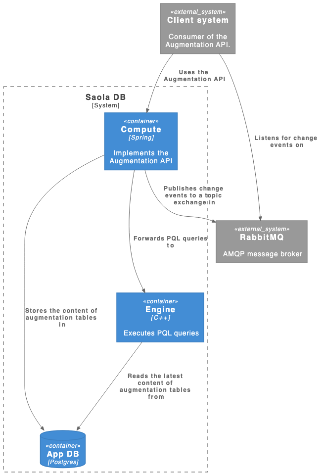

# Augmentation tables and Table Augmented Attributes

Augmentation tables allow for 'real-time' updatable tables in the data model. The tables are not created during the data model load (and thus be static until the next reload) but instead can be created, filled, modified and removed during runtime without reloading the data model. This allows to implement several operational use cases on top. 

Also, the content of augmentation tables is modified directly within the PQL.

In general, augmentation tables can be seen as extensions to regular tables that allow for storing and maintaining additional attributes associated with tuples from regular tables, or in other words, data can be augmented with additional information, like approvals, comments, pricing adjustments, etc.

# Relationship to Regular Tables
Each augmentation table is associated with exactly one regular data model table, which serves as its join partner table. Thereby, an augmentation table is always considered the fact table in this join relationship, i.e., the N-side of the join (also referred to as parent table). Regular tables on the other hand are always considered a dimension tables (i.e., 1-side; child).

Thus, an augmentation table never stands for its own, and can further not be joined with another augmentation table. Consequently, it is not possible to define a data model that solely consists of augmentation tables. It is however possible to define multiple augmentation tables for a single regular table.

# Architecture

Augmentation table definitions (schema) and contents are stored within a regular PostgreSQL database system. Changes made to augmentation tables are immediately reflected within the PostgreSQL database. The PQL engine, on the other hand, follows a lazy loading strategy, meaning not all changes are immediately reflected within the PQL engine. Instead, the engine fetches the latest augmentation data from the Postgres only if (i) a PQL query arrives that involves an augmentation table and (ii) the augmentation tables' content has changed since the last time the table was queried.

# PyCelonis

PyCelonis allows us to work with the Augmentation tables directly, this doesnt have to be confused with augmented attributes (either V1 or V2). This confusion comes from the fact that the storage that 

It calls this API internally:
https://celonis.roadie.so/catalog/default/api/cloud-integration-api#/augmentation-api-controller

# Limitations

The feature is only suited for rather small tables as PQL queries accessing these tables cause an expensive load and transformation of the tables from a third-party database system into the in-memory engine.

Therefore, several restrictions are in place: 
- A maximum number of augmentation tables can exist for a given data model. 

MAX_NUMBER_OF_TABLES	100L

- Each augmentation table can have at most a certain amount of columns. 

	MAX_NUMBER_OF_COLUMNS	28L

- Each augmentation table can have at most a certain amount of rows. 

	MAX_NUMBER_OF_ROWS_PER_TABLE	100000L

- Across all augmentation tables there can at most a certain amount of rows. 

    MAX_NUMBER_OF_DATA_MODEL_ROWS	30000000L

- The augmentation feature is only enabled if the largest data model table is not too large. 

    (I havent found the docs acout this)

- Identifier names have a maximum allowed length  (i.e., schema-/table-/column) names.

	MAX_IDENTIFIER_NAME_SIZE	63L

- String values of a string column can have at most a certain amount of bytes. 

	MAX_ALLOWED_STRING_SIZE	500L

- Table and column names generally have the same naming conventions as DM names. 
That is, letters (including unicode) and numbers are fully supported. The special characters '-' and '_' can be used as delimiter. It is recommended that table and column names do not contain any other special characters. Although most special characters currently work, they are not guaranteed to work in the future. Some special characters are explicitly blacklisted. - Table and column names are not allowed to start OR end with two consecutive '_' (i.e., underscore) characters. e.g., the following names are all INVALID: '__table', 'column__', '__foo__', '_bar__', '__baz_' e.g., the following names are all VALID: '_table', 'column_', '_foo_', '_bar__x', 'x__baz_'

- The maximum number of allowed tuples per batch request(insert, update or delete).

	MAX_BATCH_SIZE	1000

The limits are documented in the Saola compute docs:
https://compute-service.docs.saola.cloud/versions/2.31.0/cloud/celonis/compute2/augmentation/AugmentationApi.html

